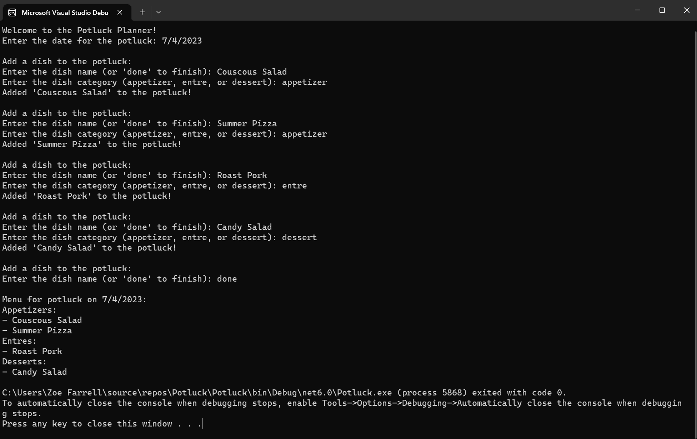

# Potluck

## Instructions

* Fork this Repository
* Clone your forked repo to your computer.
* Set up your test project, the [Unit Testing 1 lesson](https://launch.turing.edu/module1/lessons/Week4/UnitTestingI) is a great resource for this!
* Complete the activity below.
* Push your solution to your forked repo
* Send a link of what you worked on to your instructors

## Iteration 1

Create a `Dish` class that responds to the following interaction pattern and add tests for your `Dish` class:

```c#

Dish dish = new Dish("Couscous Salad", "appetizer");
Console.WriteLine(dish.Name); // Output: Couscous Salad
Console.WriteLine(dish.Category); // Output: appetizer
```

## Iteration 2

Create a `Potluck` class that responds to the following interaction pattern and add tests for you `Potluck` class:

```c#
Dish couscous_salad = new Dish("Couscous Salad", "appetizer");
Dish cocktail_meatballs = new Dish("Cocktail Meatballs", "entree");

Potluck potluck = new Potluck("7-13-18");
potluck.AddDish(couscous_salad);
potluck.AddDish(cocktail_meatballs);

Console.WriteLine(potluck.Date); // output: "7-13-18"
Console.WriteLine(potluck.Dishes.Count); // output: 2
```

## Iteration 3

Update your `Potluck` class so that it responds to the following interaction pattern and tests the update:

```c#
Potluck potluck = new Potluck("7-13-18");
Dish couscous_salad = new Dish("Couscous Salad", "appetizer");
Dish summer_pizza = new Dish("Summer Pizza", "appetizer");
Dish roast_pork = new Dish("Roast Pork", "entre");
Dish cocktail_meatballs = new Dish("Cocktail Meatballs", "entre");
Dish candy_salad = new Dish("Candy Salad", "dessert");

potluck.AddDish(couscous_salad);
potluck.AddDish(summer_pizza);
potluck.AddDish(roast_pork);
potluck.AddDish(cocktail_meatballs);
potluck.AddDish(candy_salad);

List<Dish> appetizers = potluck.GetAllFromCategory("appetizer");
Console.WriteLine(appetizers[0].Name); // output: "Couscous Salad"
Console.WriteLine(appetizers[1].Name); // output: "Summer Pizza"
Console.WriteLine(appetizers.Count); // output: 2
```

## Iteration 4

Now update your `Program.cs` to utilize your Potluck and Dish classes and support the following User interaction.

**Tip** you can use `Console.WriteLine();` to create a blank line in your console!


